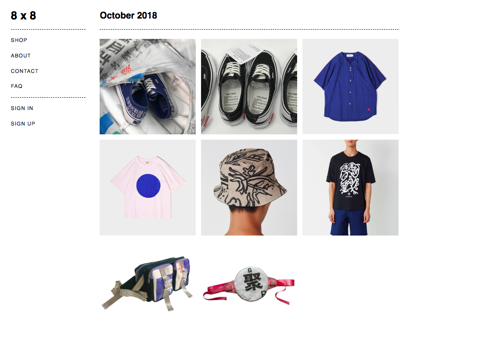

# Project#1: 8 x 8

Skip the reading and go straight to a live version of the site here: [https://eight-by-eight.herokuapp.com/](https://eight-by-eight.herokuapp.com/)

### Description
A curated web store that sells treasures found on the gigantic Chinese ecommerce site [Taobao](https://www.taobao.com/). Each month 8 thoughtfully selected and translated items from Chinese independent designers appear on the site with the aim of promoting Chinese design to a Western market.    

### Features
- User accounts with a record of the user's order history
- Shopping cart that informs the user when items have run out of stock
- Secure credit card payment via the Stripe Checkout embedded payment form
- Responsive design  

### Built With
- HTML
- CSS
- Ruby on Rails

### Gems & APIs
- Stripe
- bcrypt
- Date

### Known Bugs
- Out of stock items that are still in the user's cart during checkout are included in the customer's order.

### To Do
- About, contact and FAQ pages
- Add multiple images to each product's show page
- Show stock levels on product show pages
- Handle shipping costs
- Admin side
- Testing

### Screenshot

